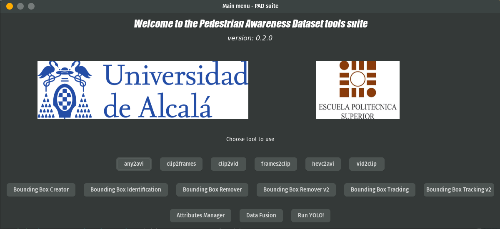

# Official Pedestrian Awarenes Dataset repository

Welcome, amigo!

This repository contains the code I developed as part of my degree's Final Project, which is called **Development of an intelligent system to detect and predict pedestrians' intentions in urban environments**. It is an integrated suite of tools to process videos, work with bounding boxes and make behavior-related stuff. Here you will also find the files resulting from the behavioral analysis I performed in that project.

[Introduction](#intro) 

[The Suite](#suite)

[The Dataset](#dataset)

I hope I can make my paper publicly available at some point. In the meantime, contact me if you have questions or comments (albertobm@protonmail.com). Or find me in LinkedIn (https://www.linkedin.com/in/alberto-barragán-moreno-821740100)

## Introduction
The project focuses on analyzing the main sources of information in vehicle-to-pedestrian interactions:

- Pedestrian behavior, such as walking, crossing, looking,...
- Pedestrian attributes, such as phone use, groups, hoods,...
- Context and environment, such as presence of designated crossings, traffic lights,...
- Vehicle parameters, such as speed and acceleration.

The combination of these factors aims to obtain an improvement in scene understanding applied to autonomous vehicles.You may want to check out the [presentation](/docs/Presentation.pdf) for a better explaination of the project's basis and outcomes.

Notice that this project has several branches:

- **master**: contains the stable versions.
- **project**: represents the state of the software when it was presented as my final project.
- **post-project**: development version with experimental features.

## The Suite
The suite is pretty straightforward and easy to use.

I strongly recommend using virtual environments to run it. I used Pipenv to manage the project and the requirements.

### Requirements
The suite is developed under Pop!\_OS (Ubuntu 18.04) in Python 3.6, but should work just fine in any other operative system.
- Codecs and formats support (for example ubuntu-restricted-extras, ffmpeg, libgstreamer, libgtk,...).
- Numpy: https://www.numpy.org
- OpenCV-contrib-Python: https://opencv-python-tutroals.readthedocs.io/en/latest/
- Munkres: https://pypi.org/project/munkres/
- screeninfo: https://pypi.org/project/screeninfo/
- wxPython: https://github.com/wxWidgets/Phoenix (you may install this from PyPi, but notice that you must have already installed the graphic libraries for your distro/OS)
- BORIS: http://www.boris.unito.it
- VLC: https://www.videolan.org/vlc/
- In order to use the _Run YOLO!_ tool you must first download the weights and configuration files from Darknet's official website, as well as the list of categories on the COCO dataset
- In order to use the _GOTURN_ tracking algorithm you must first download the Caffe model and the configuration file. These are available at OpenCV repos

### Tools description
- **any2avi**: converts video files from any format (mostly MP4) to AVI
- **clip2frames**: extracts the frames from a video file
- **clip2vid**: combines 2 or more small clips into a larger one
- **frames2clip**: creates a video from a series of frames
- **hevc2avi**: format conversion from HEVC to AVI (specifically designed for the hardware I used)
- **vid2clip**: cut a small clip from a large original video
- **Bounding Box Creator**: draw bounding boxes
- **Bounding Box Identification**: provide custom, unique identifiers to the bounding boxes in a frame
- **Bounding Box Remover**: delete bounding boxes from frames
	- v1: automatically remove a series of subjects from a series of frames
	- v2: remove the bounding boxes using a graphical interface
- **Bounding Box Tracking**: tracks subjects across a series of frames
	- v1: tracking using Kuhn-Munkres algorithm
	- v2: tracking using OpenCV trackers
- **Attributes Manager**: set attributes for the pedestrians in a scene
- **Data Fusion**: combine behavioral information with bounding boxes and subject identifiers in a single video
- **Run YOLO!**: use YOLO detection application
 
Bug reports, comments and feature suggestions are always welcome.

## The Dataset

The Pedestrian Awareness Dataset is focused on analyzing pedestrians' behavior in urban environments. It includes a series of small clips corresponding to crossing/not-crossing scenarios, bounding boxes data for subjects appearing in those scenes, and behavioral and attributes annotations for those same subjects.

Here you have an example of my work:

 

_For both privacy and storage reasons I will not publish the recorded videos here. If you are interested in getting them, please send an e-mail to albertobm@protonmail.com stating who you are, your purposes,..._

_Anyone who recognizes him or herself in any of the videos and wants to avoid its distribution can send an e-mail to albertobm@protonmail.com and I will remove it from the list of videos I can share._
